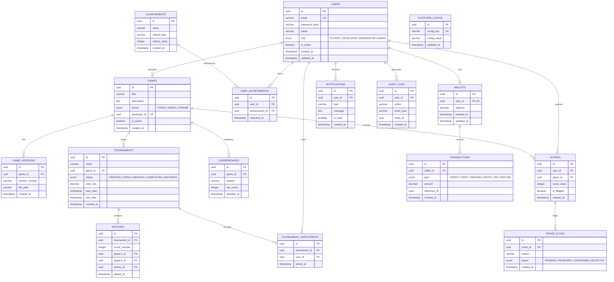

# ER Diagram — PixelOps

## Overview

This Entity-Relationship diagram defines the database schema for the PixelOps platform.

The schema supports:

- Modular game hosting
- Leaderboard management
- Tournament orchestration
- Wallet & transaction ledger
- Achievement tracking
- Fraud detection
- Notification system
- Audit logging

---

---

## Table Summary

| Table | Description |
|-------|------------|
| USERS | All platform users |
| GAMES | Game metadata |
| GAME_VERSIONS | Game version control |
| SCORES | Player score submissions |
| LEADERBOARDS | Ranking data |
| TOURNAMENTS | Tournament records |
| MATCHES | Tournament matches |
| WALLETS | Virtual currency |
| TRANSACTIONS | Wallet ledger |
| FRAUD_FLAGS | Suspicious score tracking |
| NOTIFICATIONS | User alerts |
| AUDIT_LOGS | System activity tracking |
