```mermaid
classDiagram
    direction TB

    %% ========================
    %% DOMAIN MODELS
    %% ========================

    class User {
        -id: UUID
        -email: string
        -passwordHash: string
        -name: string
        -role: UserRole
        -isActive: boolean
        -createdAt: datetime
        +activate(): void
        +deactivate(): void
    }

    class Player {
        +submitScore(gameId: UUID, score: int): void
        +joinTournament(tournamentId: UUID): void
    }

    class Developer {
        +uploadGame(game: Game): void
        +publishVersion(gameId: UUID): void
    }

    class Moderator {
        +reviewFraudFlag(flagId: UUID): void
    }

    class Admin {
        +manageUsers(): void
        +updatePlatformConfig(): void
    }

    class Game {
        <<abstract>>
        -id: UUID
        -title: string
        -description: string
        -format: GameFormat
        -isActive: boolean
        +load(): void
        +validate(): boolean
    }

    class Html5Game {
        +load(): void
    }

    class WebGLGame {
        +load(): void
    }

    class Tournament {
        -id: UUID
        -name: string
        -status: TournamentStatus
        -entryFee: decimal
        -startDate: datetime
        -endDate: datetime
        +open(): void
        +start(): void
        +complete(): void
    }

    class Match {
        -id: UUID
        -roundNumber: int
        -player1Id: UUID
        -player2Id: UUID
        -winnerId: UUID
        +setWinner(userId: UUID): void
    }

    class Score {
        -id: UUID
        -userId: UUID
        -gameId: UUID
        -scoreValue: int
        -createdAt: datetime
    }

    class Leaderboard {
        -gameId: UUID
        -season: string
        +updateRanking(score: Score): void
        +getTopPlayers(): List
    }

    class Achievement {
        -id: UUID
        -name: string
        -criteriaType: string
        -criteriaValue: int
        +isUnlocked(score: Score): boolean
    }

    class Wallet {
        -id: UUID
        -balance: decimal
        +credit(amount: decimal): void
        +debit(amount: decimal): void
    }

    class Transaction {
        -id: UUID
        -type: TransactionType
        -amount: decimal
        -createdAt: datetime
    }

    class FraudFlag {
        -id: UUID
        -reason: string
        -status: FraudStatus
        +markReviewed(): void
    }

    %% ========================
    %% SERVICES
    %% ========================

    class ScoreService {
        +submitScore(userId: UUID, gameId: UUID, score: int): void
    }

    class LeaderboardService {
        +recalculateRanking(gameId: UUID): void
    }

    class TournamentService {
        +createTournament(): Tournament
        +generateBracket(): void
    }

    class WalletService {
        +rewardUser(userId: UUID, amount: decimal): void
    }

    class XPService {
        +calculateXP(score: Score): int
    }

    class FraudValidator {
        <<abstract>>
        -next: FraudValidator
        +setNext(validator: FraudValidator): FraudValidator
        +validate(score: Score): boolean
    }

    class ScoreRangeValidator {
        +validate(score: Score): boolean
    }

    class RateLimitValidator {
        +validate(score: Score): boolean
    }

    class Repository {
        <<interface>>
        +save(entity): void
        +findById(id: UUID)
    }

    %% ========================
    %% ENUMS
    %% ========================

    class UserRole {
        <<enumeration>>
        PLAYER
        DEVELOPER
        MODERATOR
        ADMIN
    }

    class GameFormat {
        <<enumeration>>
        HTML5
        WEBGL
        IFRAME
    }

    class TournamentStatus {
        <<enumeration>>
        CREATED
        OPEN
        ONGOING
        COMPLETED
        ARCHIVED
    }

    class TransactionType {
        <<enumeration>>
        CREDIT
        DEBIT
        REWARD
        ENTRY_FEE
        REFUND
    }

    class FraudStatus {
        <<enumeration>>
        PENDING
        REVIEWED
        CONFIRMED
        REJECTED
    }

    %% ========================
    %% RELATIONSHIPS
    %% ========================

    User <|-- Player
    User <|-- Developer
    User <|-- Moderator
    User <|-- Admin

    Game <|-- Html5Game
    Game <|-- WebGLGame

    Tournament "1" --> "*" Match
    Game "1" --> "*" Score
    Game "1" --> "*" Tournament

    Player "1" --> "*" Score
    Player "1" --> "1" Wallet
    Wallet "1" --> "*" Transaction

    Score "1" --> "*" FraudFlag
    Score --> Leaderboard

    FraudValidator <|-- ScoreRangeValidator
    FraudValidator <|-- RateLimitValidator

    ScoreService --> FraudValidator
    ScoreService --> LeaderboardService
    ScoreService --> XPService
    ScoreService --> WalletService
```

# Class Diagram — PixelOps

## Overview

This class diagram represents the major domain models, service layer components, repository interfaces, and applied design patterns in the PixelOps platform.

The architecture follows:

- Clean Architecture (API → Service → Repository)
- SOLID principles
- Strong OOP implementation
- Proper usage of design patterns

---

---

## Design Patterns Used

| Pattern | Where Applied |
|----------|---------------|
| Strategy | Game loading strategies |
| Factory | Game creation logic |
| Observer | Score → XP → Notification flow |
| State | Tournament lifecycle |
| Chain of Responsibility | Fraud validation chain |
| Repository | Data access abstraction |
| Command | Score submission action |

---

## OOP Principles Demonstrated

| Principle | Implementation |
|-----------|---------------|
| Encapsulation | Private attributes in domain classes |
| Abstraction | Abstract Game & FraudValidator classes |
| Inheritance | Player/Developer extend User |
| Polymorphism | FraudValidator chain and Game subclasses |

