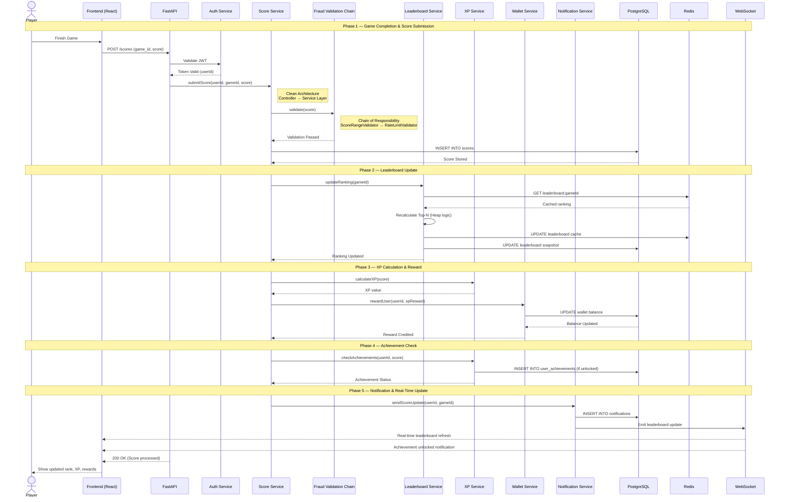

# Sequence Diagram — PixelOps

## Main Flow: Player Plays Game → Score Submission → Fraud Validation → Leaderboard Update → XP Calculation → Wallet Reward → Notification

This sequence diagram illustrates the complete lifecycle of a gameplay event in PixelOps.

The backend is implemented using FastAPI with a clean service-layer architecture.

---

---

## Flow Summary

| Phase | Description | Key Concepts |
|-------|------------|--------------|
| 1. Score Submission | Player submits score, JWT validated | Authentication, Clean Architecture |
| 2. Fraud Validation | Score validated via chained validators | Chain of Responsibility |
| 3. Leaderboard Update | Ranking recalculated & cached | Heap Algorithm, Redis Cache |
| 4. XP & Rewards | XP calculated and wallet credited | Strategy, Transaction Handling |
| 5. Notification | Real-time update via WebSocket | Observer Pattern |

---

## Design Patterns Represented

- Chain of Responsibility → Fraud validation
- Strategy → XP calculation
- Observer → Notification broadcasting
- Repository Pattern → DB access abstraction
- Clean Architecture → Controller → Service → Repository separation

