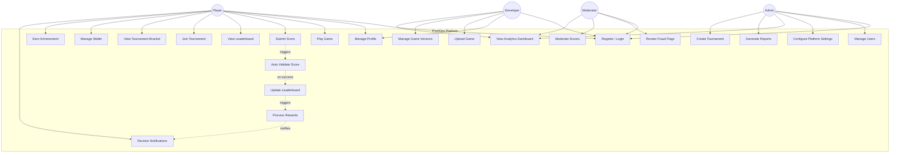

# Use Case Diagram — PixelOps

## Overview

This use case diagram represents all major interactions between users and the PixelOps platform.

Primary Actors:

- Player
- Developer
- Moderator
- Admin

The system also includes internal automated processes such as score validation, leaderboard updates, and reward processing.

---

---

## Use Case Summary

| Actor | Major Use Cases |
|--------|----------------|
| Player | Play Game, Submit Score, View Leaderboard, Join Tournament, Manage Wallet, Earn Achievements |
| Developer | Upload Game, Manage Game Versions, View Game Analytics |
| Moderator | Review Fraud Flags, Moderate Suspicious Scores |
| Admin | Manage Users, Configure Platform, Create Tournaments, View Reports |

---

## System-Triggered Use Cases

| Use Case | Description |
|----------|------------|
| Auto Validate Score | Fraud validation pipeline runs automatically on score submission |
| Update Leaderboard | Ranking recalculated after valid score |
| Process Rewards | XP and wallet rewards processed |
| Receive Notifications | Real-time WebSocket notification sent to user |

